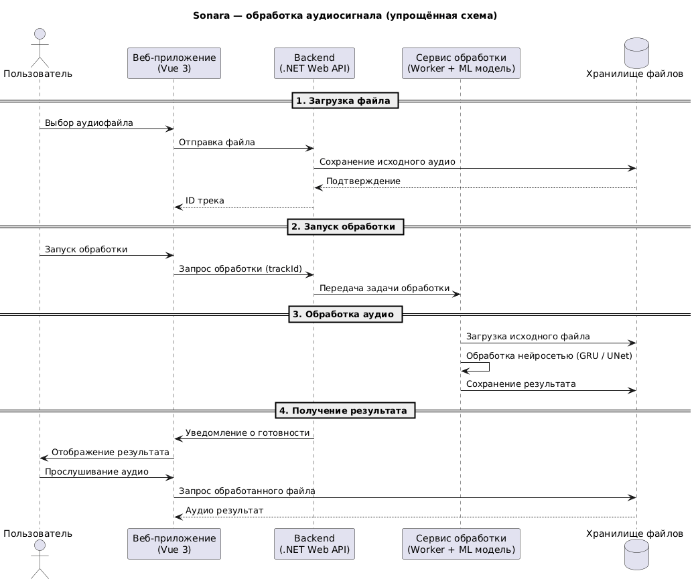

# 🎵 Sonara — AI Audio Processing Platform

> Микросервисная платформа для асинхронной обработки аудиофайлов с использованием ML-моделей.
> Backend и Worker реализованы на **C# / .NET**, взаимодействие сервисов построено на **Apache Kafka**, файлы хранятся в **MinIO**, метаданные и состояние задач — в **PostgreSQL**.

**Тип проекта:** дипломный проект + командная разработка

## 📌 О проекте

**Sonara** позволяет загружать аудиофайлы, выбирать параметры обработки и получать обработанный через AI аудио файл.

Система построена как набор независимо развиваемых сервисов:

* **Backend** — REST API, бизнес-логика, управление заданиями и состояниями
* **Worker** — асинхронная подготовка аудио и оркестрация обработки
* **ML Service** — нейросетевая обработка аудио
* **Frontend** — пользовательский интерфейс и отображение прогресса
* **PostgreSQL** — хранение метаданных и состояния задач
* **MinIO** — объектное хранилище исходных и обработанных файлов
* **Apache Kafka** — асинхронное взаимодействие между сервисами
* **SignalR** — передача изменений статуса клиенту в реальном времени

## 🛠️ Tech Stack

| Layer | Technologies |
|---|---|
| **Backend** | C#, .NET 9, ASP.NET Core Web API, EF Core, MediatR, SignalR |
| **Worker** | C#, .NET Worker Service, Kafka, MinIO |
| **Messaging** | Apache Kafka |
| **Database & Storage** | PostgreSQL, MinIO |
| **ML Service** | Python, FastAPI, PyTorch, Kafka |
| **Frontend** | Vue 3, TypeScript, Vite, Pinia, Axios, SignalR |
| **Infrastructure** | Docker, Docker Compose, Kafka UI, pgAdmin |

## 👥 Команда проекта

| Разработчик | Роль | Зона ответственности |
|---|---|---|
| **Вероника Никитина** | Backend / Full-stack Developer | Разработка **backend-сервиса на C# / .NET**, реализация **Worker-сервиса**, проектирование и работа с **PostgreSQL**, интеграция сервисов через **Apache Kafka**, работа с **MinIO**, реализация **SignalR**-уведомлений, а также разработка **frontend-приложения на Vue 3 + TypeScript** |
| **Анастасия Мыльникова** | ML / AI Developer & UI/UX Designer | Подготовка обучающих данных, проектирование архитектуры нейросетевых моделей, обучение **11 ML-моделей**, разработка **ML-сервиса на Python / FastAPI**, интеграция моделей в pipeline обработки аудио, а также разработка **дизайна приложения в Figma** |

## 👩‍💻 Результаты проекта

### 🔧 Backend

* **Разработан REST API для управления полным циклом обработки аудио**, реализованы загрузка и регистрация треков, создание и управление заданиями на **ASP.NET Core 9, C#, Entity Framework Core и PostgreSQL**, что обеспечило единый API для управления процессом обработки.

* **Реализовано управление жизненным циклом задач обработки**, введены состояния `Queued`, `Started`, `Completed` и `Failed` и механизм их обновления в **PostgreSQL**, что позволило отслеживать состояние каждой задачи от создания до завершения или ошибки.

* **Реализована асинхронная постановка задач на обработку**, настроен **Kafka Producer** для публикации событий `job.created`, что позволило отделить приём HTTP-запроса от длительного процесса обработки аудио.

* **Реализована интеграция Backend с объектным хранилищем**, подключён **MinIO** для хранения исходных и обработанных аудиофайлов, что позволило передавать между сервисами ключи объектов вместо бинарных файлов.

* **Реализована передача статусов обработки клиенту в реальном времени**, разработан **SignalR Hub** для отправки изменений состояния Job без постоянного опроса REST API.

* **Разработана бизнес-логика API**, использован **MediatR** для обработки команд и транспортного слоя.

### 👷 Worker

* **Разработан отдельный .NET Worker для асинхронной подготовки аудиозаданий**, реализован **Kafka Consumer** для получения событий `job.created` и обработка заданий вне HTTP-контекста, что позволило вынести длительные операции из Backend.

* **Реализована подготовка аудиофайлов перед ML-обработкой**, добавлены нормализация и ресемплинг аудио в Worker, после чего формируется событие `job.prepared` с параметрами обработки и ссылками на объекты **MinIO**.

* **Организована оркестрация взаимодействия между Backend и ML-сервисом**, Worker преобразует входное задание в контракт, необходимый для ML-обработки, что позволило разделить ответственность между API, подготовкой данных и ML-инференсом.

### 🗄️ Database

* **Спроектирована структура PostgreSQL для хранения состояния процесса обработки**, реализованы сущности треков и заданий, их связи и хранение статусов и ошибок через **Entity Framework Core**.

* **Реализовано управление изменениями схемы БД**, использованы **EF Core Migrations** для последовательного обновления структуры PostgreSQL при развитии проекта.

### 🤖 Интеграция с ML-сервисом

* **Разработан событийный pipeline взаимодействия .NET-компонентов с ML-сервисом**, определены контракты сообщений и последовательность событий `job.created → job.prepared → job.completed / job.failed` в **Apache Kafka**, что позволило независимо развивать Backend, Worker и ML Service.

* **Реализована интеграция Worker с ML-сервисом**, в сообщения передаются параметры обработки и ключи объектов **MinIO**, а не бинарные аудиофайлы, что отделило передачу управляющих данных от хранения больших файлов.

* **Реализована обработка результатов ML-сервиса на стороне Backend**, настроено получение событий `job.completed` и `job.failed` через **Kafka**, обновление состояния Job в PostgreSQL и последующее уведомление клиента через **SignalR**.

* **Организовано межсервисное взаимодействие с ML-компонентом в командной разработке**, интеграция построена через согласованные Kafka-контракты и object storage, что позволило разрабатывать .NET и ML-компоненты независимо друг от друга.


## 🏗️ Архитектура

<p align="center">
  
  <br>
  <em>Краткая UML диаграмма проекта</em>
</p>

[Более подробное описание архитектуры в UML диаграмме](https://github.com/nikiveron/AudioProcessing/blob/main/docs/superUml.png)

### Почему такая архитектура

Обработка аудио и ML-инференс являются длительными операциями, поэтому они не выполняются непосредственно в рамках HTTP-запроса.

Backend принимает запрос и создаёт задачу, после чего дальнейшая обработка выполняется **асинхронно через Kafka**.

Такое разделение позволяет:

* не блокировать HTTP-запрос во время ML-инференса
* независимо масштабировать Backend, Worker и ML Service
* сохранять задания в очереди при временной недоступности отдельных компонентов
* отделить бизнес-логику от ML-реализации
* добавлять новые обработчики и модели без существенного изменения Backend


## 📨 Event-Driven взаимодействие

Для взаимодействия между сервисами используется **Apache Kafka**.

Основные события:

| Topic           | Producer   | Consumer   | Назначение                       |
| --------------- | ---------- | ---------- | -------------------------------- |
| `job.created`   | Backend    | Worker     | Новое задание на обработку       |
| `job.prepared`  | Worker     | ML Service | Подготовленное задание для ML    |
| `job.completed` | ML Service | Backend    | ML-обработка завершена           |
| `job.failed`    | ML Service | Backend    | ML-обработка завершилась ошибкой |

## 🗄️ Хранение данных

### PostgreSQL

Используется для хранения:

* аудиотреков
* заданий обработки
* статусов Job
* параметров обработки
* информации об ошибках

Работа с БД реализована через **Entity Framework Core**.

### MinIO

Аудиофайлы не передаются непосредственно через Kafka.

В Kafka передаются ссылки на объекты:

```json
{
  "jobId": "guid",
  "inputKey": "tracks/input/file.wav",
  "outputKey": "tracks/output/file.wav",
  "parameters": {
    "instrument": "guitar"
  }
}
```

Worker и ML Service используют `InputKey` / `OutputKey` для работы с файлами в **MinIO**.

Это позволяет отделить передачу больших бинарных файлов от передачи управляющих сообщений через Kafka.

## 🔔 Real-time notifications

Для отслеживания состояния обработки используется **ASP.NET Core SignalR**.

Frontend устанавливает соединение с SignalR Hub и получает изменения статуса Job без постоянного polling API.

Например:

```text
Queued
  ↓
Started
  ↓
Completed
```

или при ошибке:

```text
Queued
  ↓
Started
  ↓
Failed
```

Пользователь получает актуальное состояние обработки непосредственно в интерфейсе.

## 🧪 Testing

Backend покрыт Unit-тестами

Используемый стек:

* **xUnit**
* **Moq**
* **Testcontainers**

Тестируются:

* бизнес-логика
* обработчики команд
* обработка ошибок

## 🐳 Infrastructure

Все основные компоненты запускаются в Docker Compose:

```text
backend
worker
ml-service
frontend
postgres
minio
kafka
kafka-ui
redis
pgadmin
```

## 🚀 Quick Start

### Requirements

* Docker
* Docker Compose
* Git

### Clone

```bash
git clone https://github.com/nikiveron/AudioProcessing.git
cd AudioProcessing
```

### Start

```bash
docker compose up --build
```


Дальнейшее развитие проекта включает расширение ML-моделей, поддержку дополнительных сценариев обработки и повышение покрытия автоматизированными тестами.
